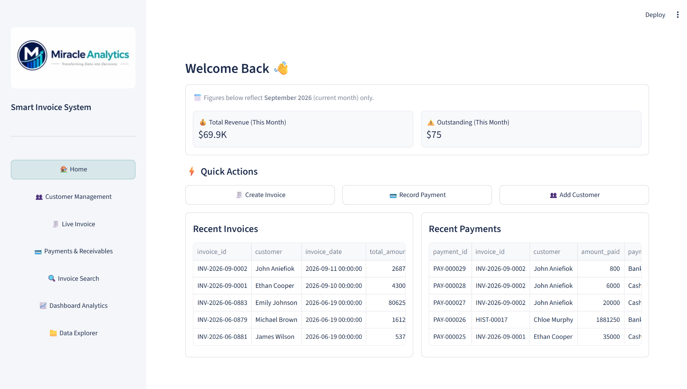
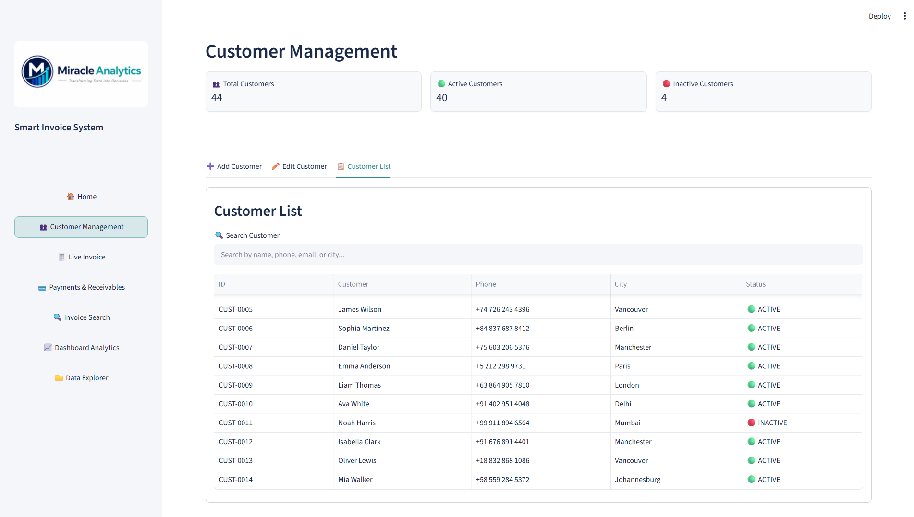
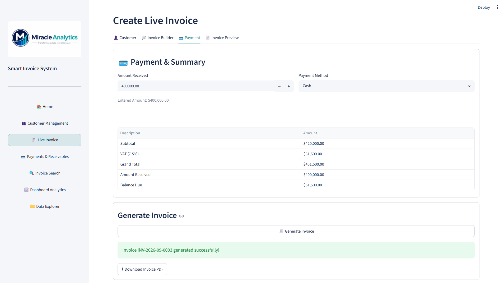
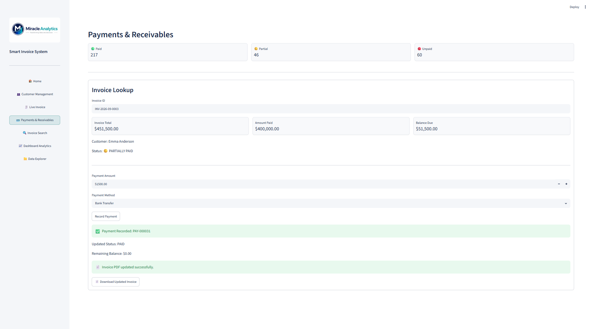
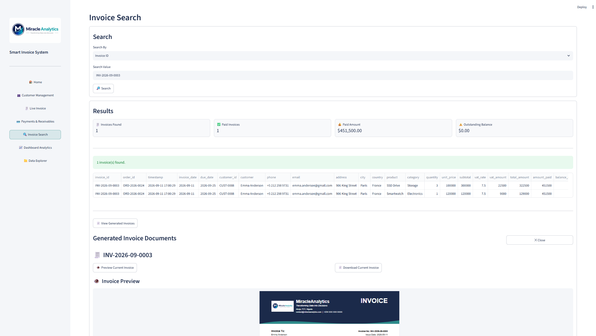
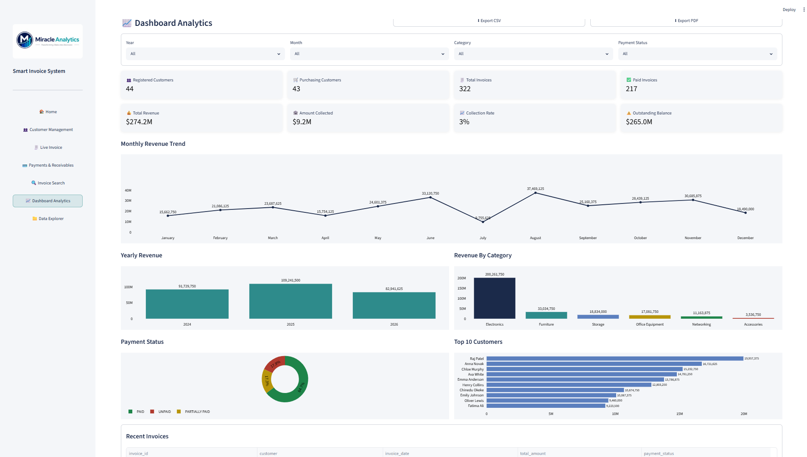
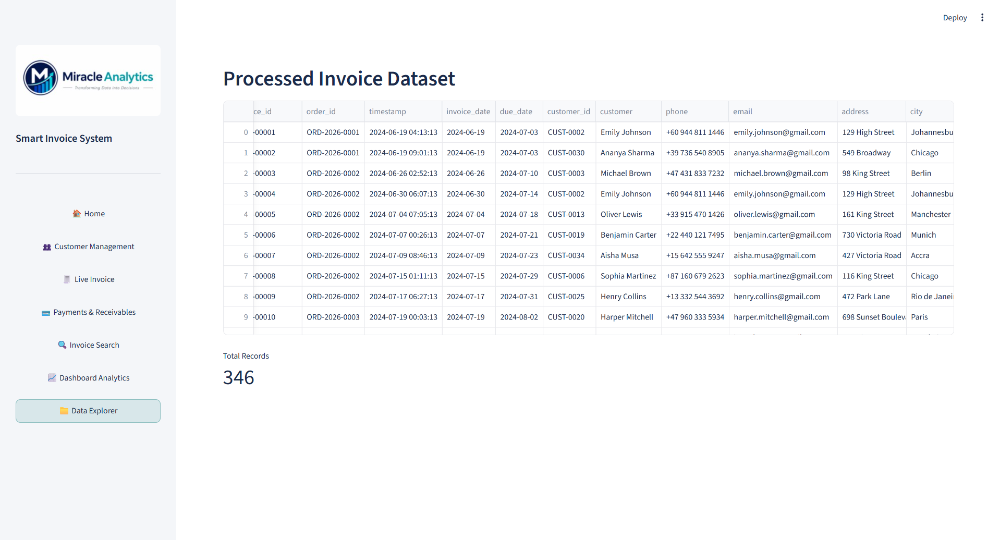

# Intelligent Invoice Management System

> A Python-based business application for invoice generation, customer management, payment tracking, receivables monitoring, invoice search, and business analytics.



## 📌 Project Overview

The **Intelligent Invoice Management System** is a centralized business application designed to manage customers, invoices, payments, receivables, invoice retrieval, and business reporting.

The application combines transaction processing, PDF document generation, payment tracking, invoice search, and analytical dashboards within a single Streamlit application.

## 🎯 Business Problem

Manual invoice creation and fragmented record keeping can make it difficult to maintain customer records, track payments, monitor outstanding balances, retrieve historical invoices, and analyze business activity.

## 💡 Solution

The system provides an integrated workflow:

**Customer Management → Invoice Creation → Payment Tracking → Invoice Search → Analytics → Data Exploration**

It automates invoice creation, maintains customer and transaction records, tracks receivables, generates PDF invoices, preserves invoice history, and provides analytical dashboards for business monitoring.

## ✨ Key Features

- Automated PDF invoice generation
- Unique invoice, order, and payment identifiers
- Customer management and status tracking
- Live invoice builder
- Payment recording and receivables tracking
- Automatic invoice PDF updates after payment
- Invoice history and version archiving
- Invoice search by Invoice ID, Order ID, Customer, and Payment Status
- Current and historical invoice preview and download
- Dashboard analytics and KPI monitoring
- Data exploration and CSV export
- Excel-based data storage
- Synthetic data generation utilities

## 📊 Application Modules

### Customer Management

Manage customer records, contact information, and customer status through a centralized interface.



### Live Invoice

Create invoices dynamically by selecting customers, adding products, recording payment information, and generating invoice documents.



### Payments & Receivables

Record customer payments, monitor balances and payment status, and automatically update related invoice records and PDF documents.



### Invoice Search

Search and retrieve invoices using multiple criteria. The module supports current and historical invoice preview and download.



### Dashboard Analytics

Monitor invoice activity, revenue, payments, customer performance, and other business metrics through an interactive dashboard.



### Data Explorer

Explore the structured business data used by the application.



## 🔄 Invoice & Payment Workflow

```text
Customer Selection
        ↓
Invoice Builder
        ↓
Invoice Generation
        ↓
PDF Invoice Creation
        ↓
Payment Recording
        ↓
Balance & Status Update
        ↓
Invoice PDF Refresh
        ↓
Historical Version Archived
        ↓
Search / Preview / Download
        ↓
Dashboard Analytics
```

## 🛠️ Technical Implementation

### Technologies

- **Python**
- **Streamlit**
- **Pandas**
- **Plotly**
- **ReportLab**
- **Microsoft Excel / OpenPyXL**
- **Kaleido**

### Application Architecture

The application uses modular Python components for:

- Customer management
- Customer and transaction ID generation
- Invoice processing
- Payment processing
- Invoice search
- PDF generation
- PDF refresh and historical archiving
- Dashboard reporting
- Data processing
- Application configuration and path management

This modular structure separates the main Streamlit interface from the underlying business logic and supports easier maintenance and future expansion.

## 💼 Business Value

The system is designed to help small and growing businesses:

- Reduce manual invoice preparation
- Improve customer record organization
- Improve payment and receivables visibility
- Maintain better transaction traceability
- Retrieve invoice records more efficiently
- Monitor financial and customer activity
- Turn operational transaction data into useful business insights

## 📁 Project Structure

```text
Intelligent Invoice Management System/
│
├── README.md
├── requirements.txt
├── .gitignore
│
├── assets/
│   ├── 01-home-dashboard.png
│   ├── 02-customer-management.png
│   ├── 03-live-invoice.png
│   ├── 04-payments-and-receivables.png
│   ├── 05-invoice-search.png
│   ├── 06-dashboard-analytics.png
│   └── 07-data-explorer.png
│
├── data/
│   ├── customer_master_data.xlsx
│   ├── invoice_input_data_300.xlsx
│   ├── payment_log.xlsx
│   ├── processed_invoices.xlsx
│   └── product_master_data.xlsx
│
└── src/
    ├── app.py
    ├── config.py
    ├── customer_engine.py
    ├── customer_id_engine.py
    ├── customer_master_generator.py
    ├── dashboard_report.py
    ├── generate_dummy_data.py
    ├── invoice_number_engine.py
    ├── live_invoice_engine.py
    ├── order_id_engine.py
    ├── paths.py
    ├── payment_engine.py
    ├── payment_id_engine.py
    ├── pdf_generator.py
    ├── pdf_refresh_engine.py
    ├── processor.py
    ├── search_engine.py
    └── __init__.py
```

## 🚀 How to Run

Install the required dependencies:

```bash
pip install -r requirements.txt
```

Run the Streamlit application:

```bash
streamlit run src/app.py
```

The application will open in your default web browser.

## 📚 Data

The project uses **synthetic/demo business data** for customers, products, invoices, payments, and related transactions.

No proprietary or confidential business records are included in this repository.

## 👩‍💻 Author

### Miracle Ogar

**Data Analyst | Business Intelligence | Data Analytics**

GitHub: [@miracleogar](https://github.com/miracleogar)

## 🎯 Project Focus

**Domain:** Business Applications / Invoicing & Financial Operations  
**Project Type:** Python Application / Business Intelligence  
**Primary Tools:** Python, Streamlit, Pandas, Plotly, ReportLab, Excel  
**Key Areas:** Invoicing, Customer Management, Payments, Receivables, Reporting & Analytics

---

## ⚠️ Disclaimer

This project is a portfolio demonstration built with synthetic data and is intended to demonstrate application development, data processing, automation, and business intelligence capabilities.